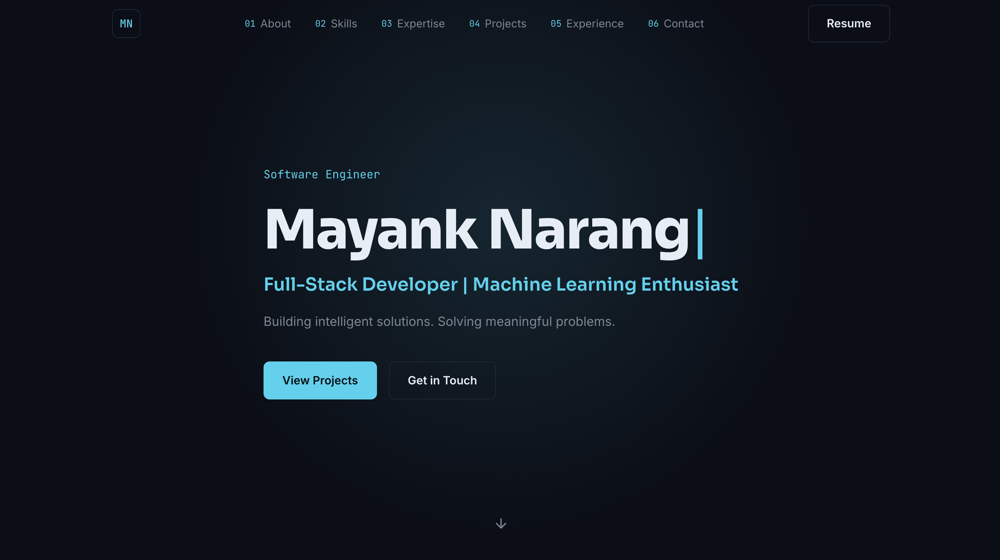

# Mayank Narang — Portfolio

[](https://portfolio-mayanknarang.vercel.app/)
[](https://react.dev)
[](https://vitejs.dev)
[](./LICENSE)

My personal developer portfolio — a dark, terminal-inspired single-page site built with React and Vite. It highlights my background, skills, projects, and experience, with a working contact form that emails me directly.

**🔗 Live: [portfolio-mayanknarang.vercel.app](https://portfolio-mayanknarang.vercel.app/)**



## Features

- **Hero section** with a typed terminal-style intro animation
- **About** — bio, photo, and quick highlights (achievements, stats)
- **Skills** — categorized tech stack shown as tags
- **Expertise** — a deeper breakdown of practical knowledge across programming, development, and soft skills
- **Projects** — swipeable carousel of project cards with tech stack, live link, and GitHub link
- **Experience & Education** — vertical timeline of roles and academic history
- **Contact form** — sends real emails via EmailJS, no backend required, plus direct email/WhatsApp/social links
- Fully responsive (mobile, tablet, desktop)
- Keyboard-accessible with visible focus states
- Respects `prefers-reduced-motion`

## Tech Stack

| Category | Tools |
|---|---|
| Framework | React 18, Vite |
| Icons | react-icons |
| Carousel | Swiper |
| Contact form | EmailJS (`@emailjs/browser`) |
| Styling | Plain CSS with a design-token system (no framework) |
| Deployment | Vercel |

## Getting Started

### Prerequisites
- Node.js 18+ and npm

### Installation

```bash
git clone https://github.com/realmayanknarang/Portfolio.git
cd Portfolio
npm install
npm run dev
```

Open [http://localhost:5173](http://localhost:5173) to view it locally.

### Environment / Contact Form Setup

The contact form uses [EmailJS](https://www.emailjs.com) to send messages without a backend. To enable it:

1. Create a free EmailJS account and connect an email service (e.g. Gmail)
2. Create an email template with `user_name`, `user_email`, and `message` variables
3. Copy your Service ID, Template ID, and Public Key into `src/components/Contact.jsx`

To update any content — text, projects, skills, links — the only file that needs editing is `src/data/content.js`.

## Build

```bash
npm run build
```

Builds to `dist/`, ready to deploy to Vercel, Netlify, GitHub Pages, or any static host.

## Deployment

This project is deployed on [Vercel](https://vercel.com). Every push to `main` triggers an automatic redeploy.

## License

This project is licensed under the MIT License — see [LICENSE](./LICENSE) for details.

## Acknowledgments

Design and structure inspired by [Akash Rout's portfolio](https://akashrout.vercel.app/).